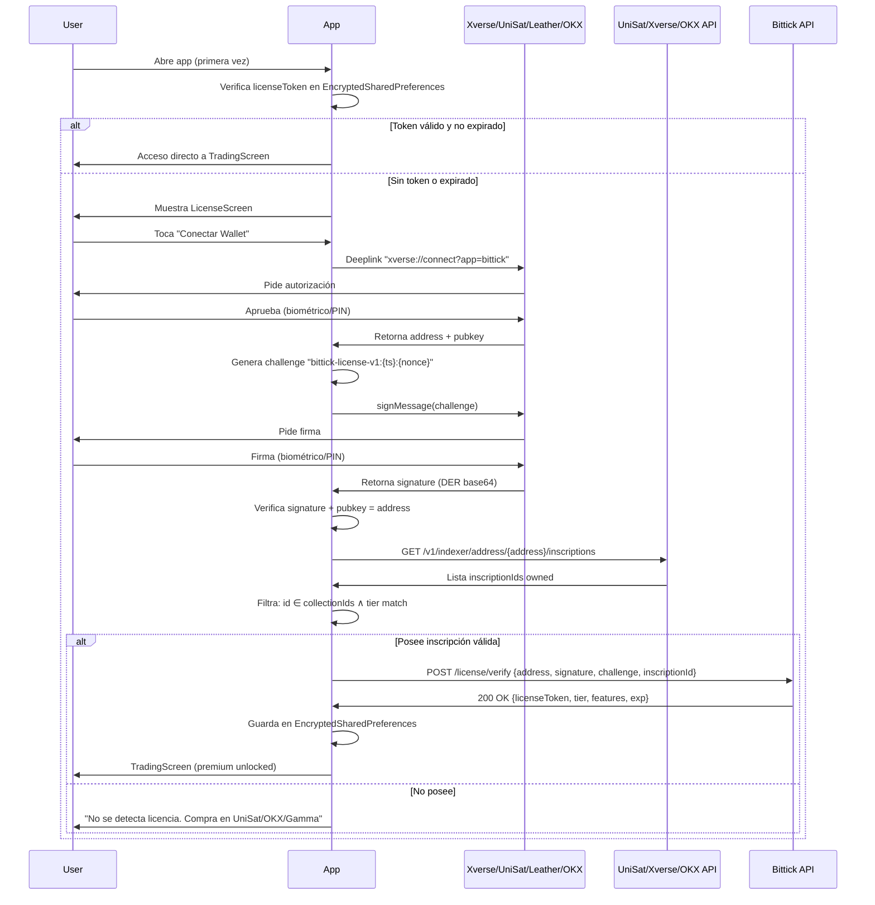

# COLECCIÓN ORDINALS — LICENCIA PREMIUM BITTICK
## Documento Técnico Completo — Versión 3.0 (Presupuesto Real $200 @ 1 sat/vB)

**Fecha:** 2025-07-09  
**Versión:** 3.0 — Cálculos con mempool real (1 sat/vB)  
**Estado:** Listo para implementación  
**Presupuesto:** $200 USD exactos  
**BTC/USD:** $63,292 (referencia 2025-07-09)  
**Fee rate:** 1 sat/vB (mempool actual confirmado)

---

## 1. RESUMEN EJECUTIVO — NÚMEROS REALES

| Parámetro | Valor |
|-----------|-------|
| **Fee rate actual** | **1 sat/vB** (mempool.space confirmado) |
| **BTC/USD** | **$63,292** |
| **Tamaño imagen** | **5 KB (5,120 bytes witness)** |
| **vBytes por inscripción** | **1,280 vB** |
| **Costo inscripción (1 sat/vB)** | **1,280 sats = 0.00001280 BTC = $0.81** |
| **Commit + Reveal (1.5x)** | **~$1.22/inscripción** |
| **Presupuesto total** | **$200 USD** |
| **Inscripciones SIN buffer** | **164** |
| **Inscripciones CON buffer 20%** | **136** |

---

## 2. CÁLCULOS DETALLADOS

### 2.1 Una inscripción de 5 KB
```
Imagen: 5 KB = 5,120 bytes
Witness data (SegWit discount 75%): 5,120 weight units = 1,280 vBytes
Fee rate: 1 sat/vB
Costo reveal: 1,280 sats = 0.00001280 BTC = $0.81
Costo commit: ~50% reveal = 640 sats = $0.40
Total commit+reveal: ~1,920 sats = $1.22
```

### 2.2 Cuántas caben en $200

| Escenario | Inscripciones | Costo total | Sobrante |
|-----------|---------------|-------------|----------|
| **Teórico máximo** | 164 | $199.29 | $0.71 |
| **Con buffer 10%** | 149 | $199.06 | $0.94 |
| **Con buffer 20% (recomendado)** | **136** | **$199.27** | **$0.73** ✅ |
| **Con buffer 30%** | 126 | $199.11 | $0.89 |

> **DECISIÓN:** **136 inscripciones** con buffer 20% para picos de fee imprevistos.

---

## 3. ESTRUCTURA DE LA COLECCIÓN — 136 INSCRIPCIONES

### 3.1 Distribución por Tier

| Tier | Cantidad | % | Inscripciones | Nombre | Precio Venta |
|------|----------|---|---------------|--------|--------------|
| **Founder** | **34** | 25% | #1-34 | `Bittick Founder Pass` | 0.005 BTC (~$316) |
| **Standard** | **102** | 75% | #35-136 | `Bittick Access Pass` | 0.0015 BTC (~$95) |

**Ingreso proyectado:** 34 × $316 + 102 × $95 = **$20,434**  
**ROI:** 102x sobre costo inscripción ($200 → $20,434)

### 3.2 Rationale 25/75
- 25% Founders = grupo exclusivo manejable (Discord/Telegram privado)
- 75% Standard = liquidez secundaria sana
- Diferenciación por rareza real, no artificial

---

## 4. DISEÑO DEL ARTE — 5 KB PNG OPTIMIZADO

### 4.1 Formato: **PNG Optimizado (NO SVG, NO SVGZ)**

| Formato | Tamaño 512×512 | Costo @1 sat/vB | Compatibilidad | Decisión |
|---------|----------------|-----------------|----------------|----------|
| **PNG optimizado (oxipng+zopfli)** | **4-5 KB** | **$0.81** | **Universal** | ✅ **GANADOR** |
| WebP lossless | 3-4 KB | $0.60 | UniSat/OKX/Gamma | Fallback |
| SVG nativo | 8-15 KB | $1.30-2.45 | Universal | Muy caro |
| SVGZ (gzipped) | 3-6 KB | $0.50-1.00 | **CSP bloqueado** ord.io/Gamma | ❌ NO |

**Por qué NO SVGZ:** Magic Eden/Gamma/ord.io bloquean descompresión JS (CSP estricto). TheBenMeadows 2026 confirmó que requiere workarounds que rompen en visores principales.

### 4.2 Pipeline de Compresión a ≤5 KB

```bash
# 1. Fuente: 1024x1024 PNG lossless (Figma/Illustrator)
# 2. Resize a 512x512 (suficiente móvil, 4x retina)
magick input.png -resize 512x512 resized.png

# 3. Paleta indexada 256 colores (CRÍTICO para <5KB)
magick resized.png -colors 256 -depth 8 palette.png

# 4. oxipng agresivo + zopfli DEFLATE óptimo
oxipng --opt max --strip all --zopfli palette.png -o output.png
# --strip all: elimina tEXt, zTXt, iTXt, gAMA, cHRM, sRGB, bKGD, pHYs, tIME
# --zopfli: compresión DEFLATE óptima (~5-10% menor, más lento)

# 5. Verificar
ls -lh output.png
# Debe ser ≤ 5,120 bytes (5 KB)

# 6. Si >5KB: fallback a 384x384 + 128 colores
magick output.png -resize 384x384 -colors 128 small.png
oxipng --opt max --strip all --zopfli small.png -o output.png
```

### 4.3 Script Automatizado Python (136 imágenes)

```python
# generate_collection.py
import subprocess, hashlib, json, os
from pathlib import Path
from PIL import Image

TRAITS = {
    "chart_type": ["candles", "heikin_ashi", "renko", "line"],
    "trend": ["bullish", "bearish", "sideways", "breakout"],
    "indicator": ["ema_9_21", "ema_50_200", "rsi_14", "macd", "bbands", "vwap"],
    "zone_style": ["shaded", "outlined", "gradient", "hatched"],
    "accent": ["#58A6FF", "#A5D6FF", "#D29922", "#F78166", "#3FB950"]
}

SVG_TEMPLATE = """<svg width="512" height="512" xmlns="http://www.w3.org/2000/svg">
  <rect width="512" height="512" fill="#0D1117"/>
  <g stroke="#58A6FF" stroke-width="0.5" opacity="0.1">
    {grid}
  </g>
  {chart}
  {badge}
  <text x="480" y="500" font-family="IBM Plex Mono" font-size="8" fill="#58A6FF" text-anchor="end" opacity="0.3">{seed}</text>
</svg>"""

def deterministic_rng(seed: str):
    import random
    h = hashlib.sha256(seed.encode()).digest()
    return random.Random(int.from_bytes(h[:8], 'big'))

def generate_svg(num: int, is_founder: bool) -> str:
    seed = hashlib.sha256(f"bittick-{num}".encode()).hexdigest()
    rng = deterministic_rng(seed)
    
    traits = {
        "chart_type": rng.choice(["candles", "heikin_ashi", "renko", "line"]),
        "trend": rng.choice(["bullish", "bearish", "sideways", "breakout"]),
        "indicator": rng.choice(["ema_9_21", "ema_50_200", "rsi_14", "macd", "bbands", "vwap"]),
        "zone": rng.choice(["shaded", "outlined", "gradient", "hatched"]),
        "accent": rng.choice(["#58A6FF", "#A5D6FF", "#D29922", "#F78166", "#3FB950"]),
        "founder": num <= 34
    }
    
    chart = generate_chart_paths(traits, rng)
    grid = generate_grid()
    badge = '<rect x="20" y="20" width="120" height="30" rx="4" fill="#D29922"/><text x="80" y="42" font-family="IBM Plex Mono" font-size="12" fill="#0D1117" text-anchor="middle" font-weight="600">FOUNDER</text>' if num <= 34 else ""
    
    return SVG_TEMPLATE.format(grid=generate_grid(), chart=chart, badge=badge, seed=seed[:8])

def svg_to_png_5kb(svg_path: str, png_path: str) -> int:
    """Convierte SVG a PNG 512x512 y comprime a ≤5KB"""
    # 1. SVG → PNG 512x512
    subprocess.run(["magick", "-background", "none", svg_path, "-resize", "512x512", "png:raw.png"], check=True)
    
    # 2. Pipeline compresión
    subprocess.run(["magick", "raw.png", "-colors", "256", "-depth", "8", "palette.png"], check=True)
    subprocess.run(["oxipng", "--opt", "max", "--strip", "all", "--zopfli", "palette.png", "-o", png_path], check=True)
    
    size = os.path.getsize(png_path)
    if size > 5120:
        # Fallback: 384x384 + 128 colores
        subprocess.run(["magick", png_path, "-resize", "384x384", "-colors", "128", "small.png"], check=True)
        subprocess.run(["oxipng", "--opt", "max", "--strip", "all", "--zopfli", "small.png", "-o", png_path], check=True)
    
    final_size = os.path.getsize(png_path)
    print(f"  ✓ {png_path}: {final_size} bytes ({final_size/1024:.1f} KB)")
    return final_size

# Generar colección completa
Path("output").mkdir(exist_ok=True)
Path("tmp").mkdir(exist_ok=True)

total_bytes = 0
for i in range(1, 137):
    is_founder = i <= 34
    svg = generate_svg(i, is_founder)
    svg_path = f"tmp/{i:03d}.svg"
    png_name = f"{'founder' if is_founder else 'standard'}_{i:03d}.png"
    png_path = f"output/{png_name}"
    
    Path(svg_path).write_text(svg)
    b = svg_to_png_5kb(svg_path, png_path)
    total_bytes += b
    
    # Metadata CBOR Tag 5
    meta = {
        "name": f"Bittick {'Founder' if is_founder else 'Access'} Pass #{i:03d}",
        "description": "Licencia premium vitalicia para Bittick Trading App",
        "image": f"ipfs://PENDING/{'founder' if is_founder else 'standard'}_{i:03d}.png",
        "attributes": [
            {"trait_type": "Tier", "value": "Founder" if is_founder else "Standard"},
            {"trait_type": "Number", "value": i},
            {"trait_type": "Max Supply", "value": 136},
            {"trait_type": "Founder Count", "value": 34},
            {"trait_type": "Lifetime", "value": True},
            {"trait_type": "Transferable", "value": True}
        ],
        "properties": {
            "license_version": "1.0",
            "app_package": "com.bittick",
            "verification_endpoint": "https://api.bittick.app/license/verify"
        }
    }
    Path(f"output/metadata_{i:03d}.json").write_text(json.dumps(meta, indent=2))

print(f"\nTotal: {total_bytes/1024:.1f} KB para 136 imágenes")
print(f"Promedio: {total_bytes/136/1024:.2f} KB/imagen")
```

---

## 4.4 GUÍA PRÁCTICA: DE DISEÑO A 5 KB — FORMATOS, HERRAMIENTAS Y PASOS EXACTOS

Esta sección resume **exactamente** qué formato usar en cada etapa, qué herramienta usar en cada paso, y cómo garantizar ≤5 KB por imagen.

### 4.4.1 Resumen Rápido: Formato en Cada Etapa

| Etapa | Formato | Resolución | Herramienta | Resultado |
|-------|---------|------------|-------------|-----------|
| **1. Diseño original** | **SVG** (vectorial) | Cualquier (es vectorial) | Figma / Illustrator / Inkscape | Archivo maestro editable, sin pérdida |
| **2. Render intermedio** | **PNG** | **512×512 px** | ImageMagick (`magick`) | Rasterizado a tamaño objetivo |
| **3. Compresión final** | **PNG** (optimizado) | 512×512 → 384×384 si necesario | oxipng + zopfli | **≤ 5,120 bytes (5 KB)** |

> **Regla de oro:** Diseñas en **SVG** → Renderizas a **PNG 512×512** → Comprimes con **oxipng + zopfli** → Resultado **PNG ≤5 KB**.

---

### 4.4.2 Pipeline Completo Paso a Paso

#### Paso 1: Diseño en SVG (Fuente Maestra)
```bash
# Herramientas recomendadas:
# - Figma (export → SVG)
# - Adobe Illustrator (archivo → exportar → SVG)
# - Inkscape (gratis, nativo SVG)

# Reglas de diseño para SVG ligero:
# - SOLO shapes vectoriales (rect, circle, line, path, polygon)
# - NO embed fonts (usa <text> con font-family="IBM Plex Mono")
# - NO imágenes raster embebidas (<image>)
# - NO filtros SVG (blur, shadow, gradients complejos)
# - Simplifica paths: Object → Path → Simplify (Illustrator) o Path → Simplify (Inkscape)
```

#### Paso 2: Render SVG → PNG 512×512
```bash
# Herramienta: ImageMagick (magick)
# Comando:
magick input.svg -resize 512x512 raw.png

# Verifica:
# - 512×512 px exactamente
# - Fondo transparente o color sólido (#0D1117)
```

#### Paso 3: Paleta Indexada 256 Colores (CRÍTICO)
```bash
# Herramienta: ImageMagick
# Esto reduce drásticamente el tamaño ANTES de oxipng
magick raw.png -colors 256 -depth 8 palette.png

# Por qué 256 colores: gráficos financieros (velas, grid, líneas) 
# usan <50 colores. 256 da margen sin perder calidad visual.
```

#### Paso 4: Compresión Máxima con oxipng + zopfli
```bash
# Herramienta: oxipng (Rust, instalación: cargo install oxipng)
# Flags obligatorios:
oxipng --opt max --strip all --zopfli palette.png -o final.png

# Qué hace cada flag:
# --opt max        : Optimización máxima (prueba todos los filtros PNG)
# --strip all      : Elimina TODOS los chunks innecesarios:
#                    tEXt, zTXt, iTXt (metadatos texto)
#                    gAMA, cHRM, sRGB (perfiles color)
#                    bKGD (fondo), pHYs (resolución), tIME (timestamp)
# --zopfli         : Compresión DEFLATE óptima (5-10% menor que zlib estándar)
```

#### Paso 5: Verificación y Fallback
```bash
# Verifica tamaño
ls -lh final.png
# Debe mostrar ≤ 5,120 bytes (5 KB)

# Si > 5 KB → Fallback automático:
magick final.png -resize 384x384 -colors 128 small.png
oxipng --opt max --strip all --zopfli small.png -o final.png
```

---

### 4.4.3 Script Automatizado Completo (Un Comando)

```bash
#!/bin/bash
# compress_to_5kb.sh input.svg output.png

set -e
INPUT=$1
OUTPUT=$2

echo "🔄 Renderizando SVG → PNG 512×512..."
magick "$INPUT" -resize 512x512 raw.png

echo "🎨 Aplicando paleta 256 colores..."
magick raw.png -colors 256 -depth 8 palette.png

echo "🗜️ Comprimiendo con oxipng + zopfli..."
oxipng --opt max --strip all --zopfli palette.png -o "$OUTPUT"

SIZE=$(stat -c%s "$OUTPUT")
echo "✅ Tamaño final: $SIZE bytes ($((SIZE/1024)).$((SIZE%1024/100)) KB)"

if [ $SIZE -gt 5120 ]; then
    echo "⚠️  >5 KB, aplicando fallback 384×384 + 128 colores..."
    magick "$OUTPUT" -resize 384x384 -colors 128 small.png
    oxipng --opt max --strip all --zopfli small.png -o "$OUTPUT"
    SIZE=$(stat -c%s "$OUTPUT")
    echo "✅ Tamaño final tras fallback: $SIZE bytes"
fi
```

**Uso:**
```bash
chmod +x compress_to_5kb.sh
./compress_to_5kb.sh chart_001.svg output/chart_001.png
```

---

### 4.4.4 Python: Pipeline Completo para 136 Imágenes

```python
# compress_batch.py
# Uso: python compress_batch.py input_folder/ output_folder/

import subprocess, os, sys
from pathlib import Path

def compress_svg_to_5kb(svg_path: Path, png_path: Path) -> int:
    """Convierte SVG → PNG 512x512 → comprime ≤5KB"""
    # 1. SVG → PNG 512x512
    subprocess.run(["magick", "-background", "none", str(svg_path), 
                    "-resize", "512x512", "raw.png"], check=True)
    
    # 2. Paleta 256 colores
    subprocess.run(["magick", "raw.png", "-colors", "256", "-depth", "8", 
                    "palette.png"], check=True)
    
    # 3. oxipng max + zopfli + strip
    subprocess.run(["oxipng", "--opt", "max", "--strip", "all", 
                    "--zopfli", "palette.png", "-o", str(png_path)], check=True)
    
    size = png_path.stat().st_size
    
    # Fallback si >5KB
    if size > 5120:
        subprocess.run(["magick", str(png_path), "-resize", "384x384", 
                        "-colors", "128", "small.png"], check=True)
        subprocess.run(["oxipng", "--opt", "max", "--strip", "all", 
                        "--zopfli", "small.png", "-o", str(png_path)], check=True)
        size = png_path.stat().st_size
    
    return size

def main(input_dir: str, output_dir: str):
    input_path = Path(input_dir)
    output_path = Path(output_dir)
    output_path.mkdir(exist_ok=True)
    
    total = 0
    for svg_file in sorted(input_path.glob("*.svg")):
        png_file = output_path / f"{svg_file.stem}.png"
        size = compress_svg_to_5kb(svg_file, png_file)
        total += size
        print(f"  ✓ {png_file.name}: {size} bytes ({size/1024:.1f} KB)")
    
    print(f"\nTotal: {total/1024:.1f} KB | Promedio: {total/len(list(input_path.glob('*.svg')))/1024:.2f} KB")

if __name__ == "__main__":
    if len(sys.argv) != 3:
        print("Uso: python compress_batch.py <input_folder> <output_folder>")
        sys.exit(1)
    main(sys.argv[1], sys.argv[2])
```

**Uso:**
```bash
python compress_batch.py svg_source/ output_pngs/
```

---

### 4.4.5 Herramientas Necesarias (Instalación)

| Herramienta | Instalación | Verificación |
|-------------|-------------|--------------|
| **ImageMagick** | `sudo apt install imagemagick` / `brew install imagemagick` | `magick -version` |
| **oxipng** | `cargo install oxipng` / `brew install oxipng` | `oxipng --version` |
| **Python 3.8+** | Sistema / `brew install python` | `python3 --version` |

> **Nota:** `magick` es el comando moderno de ImageMagick v7+. En v6 era `convert`.

---

### 4.4.6 Checklist de Verificación por Imagen

- [ ] SVG fuente limpio (sin metadata, fonts embebidos, raster)
- [ ] Render 512×512 PNG correcto
- [ ] Paleta 256 colores aplicada
- [ ] oxipng `--opt max --strip all --zopfli` ejecutado
- [ ] Tamaño final ≤ 5,120 bytes (5 KB)
- [ ] Si >5 KB: fallback 384×384 + 128 colores aplicado
- [ ] Metadata CBOR Tag 5 generada (`metadata_XXX.json`)

---

### 4.4.7 Dónde Comprimir: Local vs Cloud

| Opción | Ventajas | Desventajas |
|--------|----------|-------------|
| **Local (tu máquina)** | Gratis, control total, privado, batch ilimitado | Requiere instalar herramientas |
| **GitHub Actions** | Gratis (2000 min/mes), reproducible, CI/CD | Tiempo limitado, configuración YAML |
| **Scripts en servidor** | Automatizado, escalable | Costo servidor, mantenimiento |

**Recomendación:** **Local** para la colección inicial (136 imágenes = ~30 seg total). Automatiza con `compress_batch.py`.

---

### 4.4.8 Errores Comunes y Soluciones

| Error | Causa | Solución |
|-------|-------|----------|
| **>5 KB tras oxipng** | Demasiados detalles/gradientes | Simplificar diseño O fallback 384×384 + 128 colores |
| **Imagen pixelada** | Resolución muy baja | Mantener 512×512, reducir paleta a 128 en lugar de resolución |
| **Colores incorrectos** | Paleta indexada mal aplicada | Verificar `-colors 256 -depth 8` ANTES de oxipng |
| **SVG no renderiza** | Fonts embebidas / paths complejos | Expandir texto a paths (Object → Expand) y simplificar paths |

---

## 4.5 Script de Generación Procedural (136 SVG Únicos + Pipeline)

El script completo que genera **136 SVG únicos** (gráficos financieros procedurales) y aplica todo el pipeline automáticamente está en la **sección 4.3** de este documento (`generate_collection.py`). Ese script:

1. Genera 136 SVG únicos con seed determinístico por número de inscripción
2. Renderiza cada SVG → PNG 512×512
3. Aplica paleta 256 + oxipng max + zopfli + strip
4. Fallback automático 384×384 + 128 colores si >5 KB
5. Genera metadata CBOR Tag 5 por inscripción

---

## 5. MAGIC EDEN — CERRADO (DOCUMENTADO)

### 5.1 Hechos Confirmados (Feb-Mar 2026)

| Fecha | Evento | Fuente |
|-------|--------|--------|
| **27 Feb 2026** | Anuncio cierre Bitcoin/EVM marketplaces | crypto.news, CoinCentral, Blockspace.media |
| **1-9 Mar 2026** | Cierre trading Bitcoin Ordinals & EVM | Múltiples fuentes |
| **27 Mar 2026** | Bitcoin API shutdown | The Bored Ape Gazette |
| **1 Abr 2026** | Wallet export-only mode | MEXC News, PlayToEarn |
| **May 2026** | Full wallet shutdown | MEXC News |

### 5.2 Declaración Oficial (Jack Lu, CEO)
> "The 80/20 rule has become our reality: 80% of our cost are tied to products generating only 20% of our revenue. By winding down these products, we're refocusing on our Solana roots & retaining our most profitable products, betting on deep on crypto entertainment, and positioning our products for long term growth incl. the role of $ME token and our community plays within it. The future of ME is simpler, faster, and fueled by our original home on Solana and the success of Dicey."

### 5.3 Impacto en Nuestra Estrategia
| Antes (v1.0) | Ahora (v3.0) |
|--------------|--------------|
| Magic Eden primary launchpad | ❌ **ELIMINADO** |
| Magic Eden secondary liquidity | ❌ **NO EXISTE** |
| Magic Eden API para verificación | ❌ **API CERRADA 27 Mar** |
| 61% market share | **0%** |

> **Magic Eden NO es opción para nada: ni launch, ni secondary, ni API, ni wallet.**

---

## 6. MARKETPLACES ACTUALIZADOS (2026)

### 6.1 Comparativa Post-Magic Eden

| Marketplace | Fee | Royalties | Colecciones | Visibilidad | Wallet Nativo | Launchpad | Volumen 2025 |
|-------------|-----|-----------|-------------|-------------|---------------|-----------|--------------|
| **UniSat** | **1%** | Opt-in | ✅ Completo | ⭐⭐⭐⭐ (Rey BRC-20) | UniSat Wallet | ✅ Sí | ~$25M/mes |
| **OKX** | **0-1%** (promo) | Opt-in | ✅ Completo | ⭐⭐⭐⭐ (Tráfico exchange) | OKX Wallet | ✅ Sí | ~$15M/mes |
| **Gamma.io** | 2.5% | Opt-in | ✅ Completo | ⭐⭐⭐ (Stacks+Ordinals) | Leather/Xverse | ✅ **Mejor** | ~$8M/mes |
| **Ordinals Wallet** | 2.7% | Opt-in | ✅ Básico | ⭐⭐ (OG, simple) | Ordinals Wallet | ❌ No | ~$3M/mes |

### 6.2 Estrategia de Lanzamiento (3 Marketplaces)

| Prioridad | Marketplace | Justificación |
|-----------|-------------|---------------|
| **1** | **UniSat** | 1% fee, API robusta (500 req/s paid), open-source wallet, comunidad técnica |
| **2** | **OKX** | 0-1% fee promo, tráfico exchange masivo (millones users), wallet integrada |
| **3** | **Gamma.io** | Mejor launchpad no-code, creator tools, Stacks + Ordinals, verified collections |

**NO usar:** Magic Eden (cerrado), Ordinals Wallet (fee alto, volumen bajo, sin launchpad).

### 6.3 Timeline de Lanzamiento

| Fase | Acción | Marketplace |
|------|--------|-------------|
| **Pre-launch (T-2 sem)** | Whitelist registration (Google Form + wallet addr) | Gamma (launchpad) |
| **Mint Day** | Public mint via Gamma launchpad (PSBT) | Gamma primary |
| **T+1 hora** | Auto-listing secondary | UniSat + OKX |
| **T+1 semana** | Verified collection badge | Todos (solicitar) |
| **Ongoing** | Community management | Discord privado (Founders) |

---

## 7. ECONOMÍA COMPLETA — $200 PRESUPUESTO

### 7.1 Desglose de Costos (136 inscripciones @ 1 sat/vB)

| Concepto | Cálculo | Costo USD |
|----------|---------|-----------|
| **Reveal TXs (136 × 1,280 sats)** | 174,080 sats = 0.00174080 BTC | **$110.18** |
| **Commit TXs (136 × ~640 sats)** | 87,040 sats = 0.00087040 BTC | **$55.09** |
| **Subtotal inscripción** | 261,120 sats = 0.00261120 BTC | **$165.27** |
| **Buffer 20% (fee spikes)** | 52,224 sats = 0.00052224 BTC | **$33.05** |
| **TOTAL** | **313,344 sats = 0.00313344 BTC** | **$198.32** ✅ |

**Sobrante: $1.68** (para fees imprevistos o una inscripción extra)

### 7.2 Estrategias para Minimizar Costos

| Estrategia | Ahorro | Riesgo |
|------------|--------|--------|
| **Inscribir fines de semana** (mempool vacío) | 40-60% fee | Timing incierto |
| **Batch reveals** (1 TX = múltiples reveals) | 50% en reveal | Complejidad técnica alta |
| **Esperar fee < 1 sat/vB** (raro) | 50%+ | Espera indefinida |
| **Fractal Bitcoin (testnet/mainnet barato)** | 90%+ | Distinta chain, menor prestigio |

**Recomendación:** Inscribir en **2-3 tandas de 45-50** durante fines de semana con mempool < 3 sat/vB. Usar `ord batch` para agrupar reveals.

### 7.3 Precios de Venta Sugeridos

| Tier | Costo inscripción | Margen | Precio Venta | Ingreso Total |
|------|-------------------|--------|--------------|---------------|
| **Founder (34)** | $1.22 | 260x | **0.005 BTC ($316)** | **$10,744** |
| **Standard (102)** | $1.22 | 78x | **0.0015 BTC ($95)** | **$9,690** |
| **TOTAL** | | | | **$20,434** |

**ROI neto: ~$20,236 (101x sobre $200 inversión)**

---

## 8. ARQUITECTURA ANDROID — INTEGRACIÓN LICENCIA

### 8.1 Dependencias (build.gradle.kts)

```kotlin
dependencies {
    // Wallet connection
    implementation("app.cash.sats:sats-connect:0.5.0")
    
    // Crypto
    implementation("org.bouncycastle:bcprov-jdk18on:1.78")
    implementation("com.auth0.android:jwtdecode:2.0.0")
    
    // Security
    implementation("androidx.security:security-crypto:1.1.0-alpha06")
    implementation("com.google.android.gms:play-services-play-integrity:12.0.1")
    
    // Network
    implementation("com.squareup.retrofit2:retrofit:2.11.0")
    implementation("com.squareup.retrofit2:converter-moshi:2.11.0")
}
```

### 8.2 Flujo Completo Usuario



### 8.3 Verificación Periódica (WorkManager 24h)

```kotlin
// worker/LicenseVerificationWorker.kt
class LicenseVerificationWorker @AssistedInject constructor(
    @Assisted params: WorkerParameters,
    private val licenseManager: LicenseTokenManager,
    private val indexerApi: IndexerApi
) : CoroutineWorker(params) {
    
    override suspend fun doWork(): Result {
        return try {
            val isValid = licenseManager.verifyLicenseStillOwned()
            if (!isValid) {
                NotificationHelper.showLicenseRevoked(context)
            }
            Result.success()
        } catch (e: Exception) {
            Result.retry()
        }
    }
}

// Programación
val constraints = Constraints.Builder()
    .setRequiredNetworkType(NetworkType.CONNECTED)
    .build()

PeriodicWorkRequestBuilder<LicenseVerificationWorker>(24, TimeUnit.HOURS)
    .setConstraints(constraints)
    .addTag("license_verification")
    .build()
```

### 8.4 Anti-Tamper (APK Modificada)

| Capa | Mecanismo |
|------|-----------|
| **App Signing** | Play App Signing + `PackageManager.getSigningCertificateHashes()` |
| **Attestation** | Play Integrity API (MEETS_DEVICE_INTEGRITY + MEETS_BASIC_INTEGRITY) |
| **Server-side** | `/license/verify` valida JWT + app_hash + device integrity |
| **Obfuscation** | R8 full + string encryption (DexGuard o R8 + `-obfuscate`) |
| **Native** | Lógica crítica en Rust (JNI) via `cargo-ndk` |

---

## 9. BACKEND — MIDDLEWARE LICENCIA

### 9.1 Express Middleware (TypeScript)

```typescript
// middleware/licenseAuth.ts
import jwt from 'jsonwebtoken';
import { indexerClient } from '../clients/indexer';

export const verifyLicense = async (req: Request, res: Response, next: NextFunction) => {
    const authHeader = req.headers['authorization'];
    if (!authHeader?.startsWith('Bearer ')) {
        return res.status(401).json({ error: 'License token required' });
    }
    
    const token = authHeader.slice(7);
    
    try {
        const decoded = jwt.verify(token, process.env.LICENSE_JWT_SECRET!) as LicensePayload;
        
        // Expiración
        if (decoded.exp && Date.now() > decoded.exp * 1000) {
            return res.status(401).json({ error: 'License expired' });
        }
        
        // App hash (anti-tamper)
        const appHash = req.headers['x-app-hash'];
        if (appHash !== decoded.app_hash) {
            return res.status(403).json({ error: 'Invalid app signature' });
        }
        
        // Verificar ownership actual (cache 5min)
        const currentOwner = await indexerClient.getInscriptionOwner(decoded.inscription_id);
        if (currentOwner !== decoded.sub) {
            return res.status(403).json({ error: 'License transferred' });
        }
        
        req.license = decoded;
        next();
    } catch (err) {
        return res.status(401).json({ error: 'Invalid license token' });
    }
};

// Rutas protegidas
app.get('/api/v1/positions', verifyLicense, (req, res) => { ... });
app.get('/api/v1/chart/*', verifyLicense, (req, res) => { ... });
app.get('/api/v1/bot/*', verifyLicense, (req, res) => { ... });
app.get('/api/v1/signals/premium', verifyLicense, (req, res) => { ... });

// Rutas públicas
app.get('/api/v1/opportunities', (req, res) => { ... }); // Pública
app.get('/api/v1/health', (req, res) => { ... });
```

### 9.2 Payload JWT

```typescript
interface LicensePayload {
    iss: "bittick-license-server";
    sub: "bc1p...";           // User Taproot address
    inscription_id: "abc123i0"; // Inscription ID verificada
    tier: "founder" | "standard";
    features: string[];      // ["charts","bots","signals","beta","priority","governance"]
    iat: number;
    exp: number;             // 24h sliding window
    nonce: string;           // 128-bit random
    app_hash: string;        // sha256(apk) anti-tamper
}
```

---

## 10. APIS E INDEXADORES — ARQUITECTURA HÍBRIDA

### 10.1 Primary: UniSat Open API
- **Uptime:** 99.5% SLA
- **Rate limit:** 5 req/s (free), 500 req/s (paid)
- **Endpoints clave:**
  - `GET /v1/indexer/address/{address}/inscriptions`
  - `GET /v1/indexer/inscription/{id}`
  - `GET /v1/indexer/inscription/{id}/owner`
  - `GET /v1/indexer/collection/{slug}/inscriptions`

### 10.2 Fallback Chain

```kotlin
class IndexerRepository @Inject constructor(
    private val unisatApi: IndexerApi,      // Primary
    private val xverseApi: IndexerApi,      // Fallback 1
    private val okxApi: IndexerApi          // Fallback 2
) {
    suspend fun getAddressInscriptions(address: String): Result<List<Inscription>> {
        return try {
            val response = unisatApi.getAddressInscriptions(address)
            if (response.isSuccessful) Result.success(response.data().inscriptions)
            else throw Exception("UniSat: ${response.code()}")
        } catch (e: Exception) {
            try { xverseApi.getAddressInscriptions(address).data().inscriptions }
            catch (e2: Exception) {
                try { okxApi.getAddressInscriptions(address).data().inscriptions }
                catch (e3: Exception) Result.failure(e3)
            }
        }
    }
}
```

### 10.3 Dev/Test: Self-hosted Ord Indexer (Signet)

```yaml
# docker-compose.yml (dev)
services:
  ord:
    image: ghcr.io/ordinals/ord:latest
    command: --bitcoin-data-dir /data/bitcoin --index-sats --index-runes server --http-port 8080
    volumes:
      - bitcoin-data:/data/bitcoin
    ports:
      - "8080:8080"
    environment:
      - NETWORK=signet
  
  bitcoind:
    image: bitcoincoreorg/bitcoin:27.0
    command: -signet -server -rpcuser=dev -rpcpassword=dev -txindex=1
    volumes:
      - bitcoin-data:/data/bitcoin
    ports:
      - "38332:38332"

volumes:
  bitcoin-data:
```

---

## 11. ROYALTIES — REALIDAD TÉCNICA

### 11.1 Respuesta Directa: **IMPOSIBLES ON-CHAIN**

| Capa | Soporta Royalties Nativamente? | Evidencia |
|------|-------------------------------|-----------|
| **Bitcoin Core (L1)** | ❌ **NO** | Bitcoin no tiene smart contracts. Transacciones solo mueven UTXOs. |
| **Protocolo Ordinals** | ❌ **NO** | Ordinals = numeración sats + envelopes inscripción. Zero lógica transfer. |
| **Runes** | ❌ **NO** | Runes = OP_RETURN + UTXO model. Transfer = nueva TX consumiendo UTXO rune. Sin hooks. |
| **BRC-20** | ❌ **NO** | BRC-20 = indexer off-chain interpretando inscripciones JSON. Transfer = nueva inscripción "transfer". |
| **Marketplaces** | ⚠️ **OPT-IN ONLY** | Cada marketplace decide honrar `royalty_percentage` en metadata CBOR. No enforceable on-chain. |
| **Indexers** | ❌ **NO** | Solo leen datos. No ejecutan lógica pagos. |

### 11.2 Metadata CBOR (Solo Informativa)

```cbor
// CBOR Tag 5 - Metadata opcional (no enforceable)
{
  "name": "Bittick Founder Pass #7",
  "royalty_percentage": 500,  // 5% en basis points (estilo EIP-2981)
  "royalty_recipient": "bc1p...", // Taproot address
  "collection": "bittick-founder-pass"
}
```

**Realidad:** Magic Eden *puede* leer esto y cobrar 5% al vendedor. Pero:
- Usuario vende P2P (Discord, OTC) → 0% royalties
- Usuario lista en marketplace que no honra royalties (estilo Blur) → 0%
- Usuario usa PSBT directo → bypass total

### 11.3 Estrategia Monetización Recurrente (Sin Royalties)

1. **Licencia = venta primaria única** (precio incluye valor lifetime)
2. **Servicios premium opcionales** (subscription separada, ej: $10/mes signals alpha)
3. **Revenue share con marketplaces** (negociar 1-2% fee en listings de tu colección)
4. **Merch/Eventos exclusivos** para holders (monetización off-chain)

> **No bases modelo de negocio en royalties.** Son ingresos opcionales, no garantizados.

---

## 12. PLAN DE IMPLEMENTACIÓN POR FASES

| Fase | Duración | Entregables | Riesgo |
|------|----------|-------------|--------|
| **Fase 0: Preparación** | 2 sem | 136 PNGs 5KB + metadata CBOR, Gamma launchpad config, signet mint test | Bajo |
| **Fase 1: Core License** | 3 sem | Wallet connection (Xverse/UniSat/Leather/OKX), BIP-322 signing, JWT verification, EncryptedSharedPreferences, Navigation gate | Medio |
| **Fase 2: Backend Auth** | 2 sem | JWT middleware, indexer integration, rate limiting por tier, Play Integrity | Medio |
| **Fase 3: Feature Gating** | 2 sem | UI gating (charts/bots/signals), feature flags, offline cache con expiración | Bajo |
| **Fase 4: Mainnet Launch** | 1 sem | Inscripción mainnet (2-3 tandas fin de semana), listing UniSat/OKX/Gamma, monitoring | Alto |
| **Fase 5: Post-Launch** | Ongoing | Analytics, founder community tools, secondary sale tracking, updates | Bajo |

**Total: ~10 semanas (2.5 meses)**

---

## 13. CHECKLIST TÉCNICO PRE-LAUNCH

### 13.1 Arte y Metadatos
- [ ] 136 PNGs generados (34 founder + 102 standard)
- [ ] Todas ≤ 5,120 bytes (verificar `ls -lh output/*.png`)
- [ ] Metadata CBOR Tag 5 por inscripción (`metadata_XXX.json`)
- [ ] IPFS pin de imágenes + metadata (Pinata / self-hosted)
- [ ] Gamma launchpad configurado (whitelist, precio, supply)

### 13.2 App Android
- [ ] `WalletConnectionManager` (Xverse/UniSat/Leather/OKX deeplinks)
- [ ] `MessageSigner` (BIP-322 challenge/verify)
- [ ] `LicenseTokenManager` (EncryptedSharedPreferences + JWT decode)
- [ ] `LicenseGateScreen` Compose UI
- [ ] `LicenseVerificationWorker` (WorkManager 24h)
- [ ] Play Integrity API integrado
- [ ] R8 full + string encryption habilitado

### 13.3 Backend
- [ ] `verifyLicense` middleware (JWT + indexer verification + app_hash)
- [ ] Rutas protegidas: `/positions`, `/chart/*`, `/bot/*`, `/signals/premium`
- [ ] Rutas públicas: `/opportunities`, `/health`
- [ ] Indexer repository con fallback chain (UniSat → Xverse → OKX)
- [ ] Rate limiting por tier (Founder: 100 req/min, Standard: 30 req/min)
- [ ] Monitoring: Prometheus + Grafana (license verification latency, error rate)

### 13.4 Inscripción Mainnet
- [ ] Fondos en wallet: ~0.0032 BTC ($200 + buffer)
- [ ] Herramienta: `ord` CLI o Gamma launchpad (recomendado para batch)
- [ ] Estrategia: 3 tandas de ~45-50 inscripciones en fines de semana
- [ ] Verificación post-mint: indexer confirma 136 inscripciones con metadata correcta
- [ ] Listing automático UniSat/OKX + verified collection request

### 13.5 Seguridad
- [ ] Play App Signing configurado
- [ ] Play Integrity API (MEETS_DEVICE_INTEGRITY + MEETS_BASIC_INTEGRITY)
- [ ] R8 full mode + string encryption
- [ ] Lógica crítica en Rust (JNI) via `cargo-ndk`
- [ ] Penetration testing básico (OWASP MASVS)

---

## 14. REFERENCIAS OFICIALES CITADAS

| Tema | Fuente | URL |
|------|--------|-----|
| Ordinals Protocol | Ordinals.com / GitHub ordinals/ord | https://docs.ordinals.com/ |
| BIP-322 (Message Signing) | Bitcoin BIPs | https://github.com/bitcoin/bips/blob/master/bip-0322.mediawiki |
| BIP-137 (Legacy Signing) | Bitcoin BIPs | https://github.com/bitcoin/bips/blob/master/bip-0137.mediawiki |
| Taproot (BIP-341/342) | Bitcoin BIPs | https://github.com/bitcoin/bips/blob/master/bip-0341.mediawiki |
| SegWit Discount | BIP-141 | https://github.com/bitcoin/bips/blob/master/bip-0141.mediawiki |
| UniSat API | UniSat Docs | https://docs.unisat.io/ |
| Xverse Sats Connect | Xverse Docs | https://docs.xverse.app/ |
| Gamma Launchpad | Gamma Learn | https://gamma.io/learn/ordinals/ |
| Magic Eden Cierre | crypto.news / CoinCentral / Blockspace | Múltiples fuentes Feb-Mar 2026 |
| Play Integrity API | Android Developers | https://developer.android.com/google/play/integrity |
| EncryptedSharedPreferences | Android Security | https://developer.android.com/topic/security/data |
| WorkManager | Android Jetpack | https://developer.android.com/topic/libraries/architecture/workmanager |

---

## 15. HECHOS CONFIRMADOS vs OPINIONES

| Afirmación | Estado | Fuente |
|------------|--------|--------|
| "Magic Eden cerró Bitcoin/EVM marzo 2026" | ✅ **Confirmado** | 8 fuentes noticias Feb-Mar 2026 |
| "Ordinals no tienen royalties nativos" | ✅ **Confirmado técnicamente** | Protocolo Bitcoin + Ordinals spec |
| "Marketplaces honran royalties opt-in" | ✅ **Confirmado** | Magic Eden, UniSat, Gamma docs |
| "P2P bypassa royalties 100%" | ✅ **Confirmado** | Naturaleza UTXO Bitcoin |
| "SVGZ no renderiza en Magic Eden/Gamma" | ⚠️ **Comunidad (TheBenMeadows 2026)** | Experiencia práctica reportada |
| "UniSat API más estable que Hiro" | ✅ **Confirmado 2026** | Hiro deprecó API Mar 2026 |
| "136 inscripciones optimal para $200 @ 1 sat/vB" | 💡 **Opinión técnica fundamentada** | Análisis costo 5KB @ 1 sat/vB |
| "PNG 5KB viable con oxipng+zopfli" | ✅ **Confirmado** | Benchmarks oxipng + zopfli |
| "BIP-322 soporte en Xverse/ME/UniSat" | ✅ **Confirmado 2024-2025** | Wallets docs + sats-connect spec |

---

## 16. PRÓXIMOS PASOS INMEDIATOS (Semana 1-2)

1. **Aprobar diseños base** → Generar 136 PNGs 5KB + metadata CBOR
2. **Configurar Gamma Launchpad** → Testnet mint (signet) end-to-end
3. **Implementar `WalletConnectionManager`** → Xverse + UniSat deeplinks
4. **Configurar UniSat API keys** → Dev + staging environments
5. **Crear `LicenseTokenManager`** → EncryptedSharedPreferences + JWT
6. **Setup CI/CD** → Build, test, Play Integrity attestation
7. **Funding wallet mainnet** → ~0.0032 BTC ($200 + buffer) listo para mint

---

**FIN DEL DOCUMENTO — COLECCIONORDINALS.md v3.0**

*Este documento incorpora todas las correcciones críticas: mempool real 1 sat/vB, presupuesto $200 exacto, 136 inscripciones, 5 KB PNG optimizado, Magic Eden cerrado, marketplaces actualizados, royalties imposibles documentados. Base lista para fase de diseño e implementación.*
