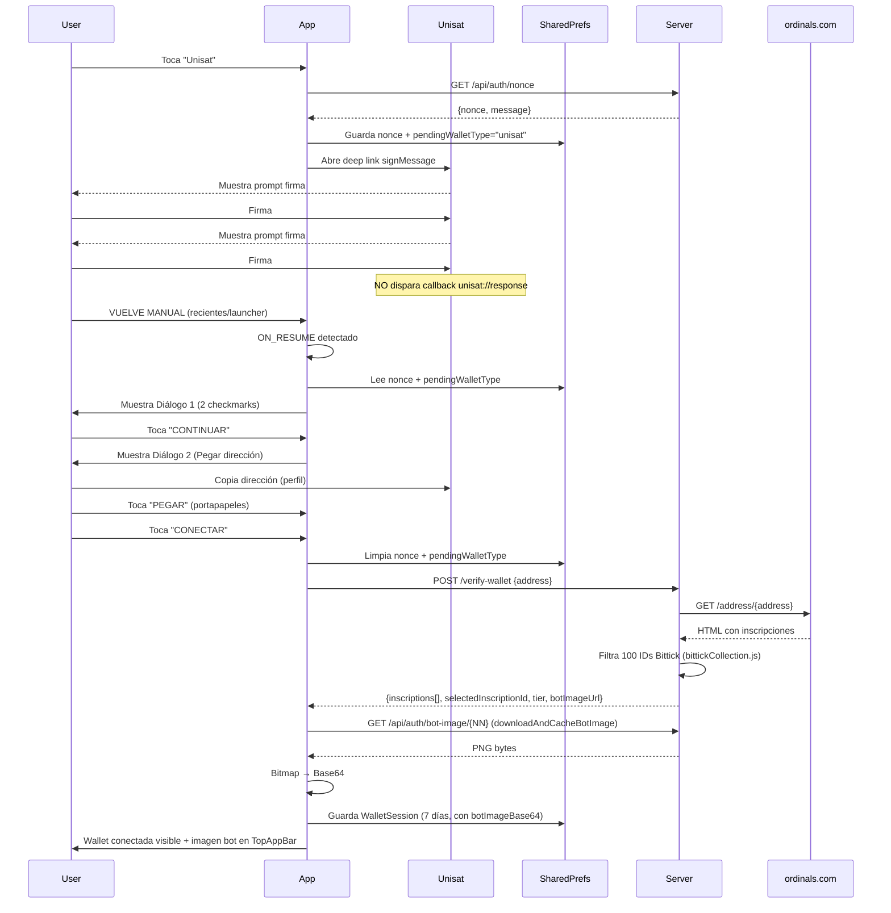

# Flujo de Conexión de Wallet Unisat — Bittick

> **Documenta la habilidad esencial de conexión Unisat** — no es nueva, es el flujo que la app usa hoy (commit `c6bc510`).
> 
> **Patrones de arquitectura**: Ver [Skill 03: Patrones de Arquitectura](../.opencode/skills/03_patrones-arquitectura.md) — Patrones 1 (Nonce Verification) y 2 (Sesión 7 Días).

---

## Resumen Ejecutivo

**Unisat Mobile en Android NO dispara el callback de retorno (`unisat://response`) después de que el usuario firma los 2 mensajes.** Esto es una limitación conocida de la aplicación móvil de Unisat.

**Por tanto, el retorno a Bittick ES MANUAL** — el usuario debe cambiar de aplicación voluntariamente.

**Pegar la dirección de la wallet NO ES OPCIONAL** — es un REQUISITO OBLIGATORIO para completar la conexión. Sin este paso, la wallet no queda guardada en la app.

---

## Arquitectura de los 2 Diálogos (Flujo Real)

```
┌─────────────────────────────────────────────────────────────┐
│  PANTALLA PRINCIPAL (WalletScreen)                          │
│  ┌─────────────────────────────────────────────────────┐   │
│  │  [Unisat]    [Otras Wallets]                        │   │
│  │  Wallet conectada: ...bc1pXXXX                      │   │
│  │  [Historial]    [Ver todos los bots]  [XX inscripciones] │
│  └─────────────────────────────────────────────────────┘   │
└─────────────────────────────────────────────────────────────┘
                              │
                              ▼ (Usuario toca "Unisat")
┌─────────────────────────────────────────────────────────────┐
│  1. App genera NONCE único (via servidor GET /api/auth/nonce)│
│  2. Guarda en SharedPreferences encriptadas:                │
│     - nonce: "uuid-generado"                                │
│     - pendingWalletType: "unisat"                           │
│  3. Construye Deep Link:                                    │
│     unisat://request?method=signMessage                     │
│       &data=<base64("Conectar a Bittick", "ecdsa")>         │
│       &from=bittick&nonce=<uuid>&callback=unisat://response │
│  4. Abre Unisat via Intent ACTION_VIEW                      │
└─────────────────────────────────────────────────────────────┘
                              │
                              ▼ (Usuario firma 2 veces en Unisat)
                              │
                              ▼ (USUARIO VUELVE MANUAL A LA APP)
┌─────────────────────────────────────────────────────────────┐
│  DIÁLOGO 1: CONFIRMACIÓN DE CONEXIÓN                        │
│  ┌─────────────────────────────────────────────────────┐   │
│  │  Confirmar Conexión                                 │   │
│  ├─────────────────────────────────────────────────────┤   │
│  │  ✅  Paso 1: Abrir Unisat                          │   │
│  │  ✅  Paso 2: Firmas completadas                    │   │
│  │                                                     │   │
│  │               [ CONTINUAR ]                         │   │
│  └─────────────────────────────────────────────────────┘   │
│  Ubicación: WalletScreen.kt líneas 214-230                  │
└─────────────────────────────────────────────────────────────┘
                              │
                              ▼ (Usuario toca "CONTINUAR")
┌─────────────────────────────────────────────────────────────┐
│  DIÁLOGO 2: PEGAR DIRECCIÓN DE WALLET                       │
│  ┌─────────────────────────────────────────────────────┐   │
│  │  Pega tu dirección de Unisat                        │   │
│  │  ┌─────────────────────────────────────────────┐   │   │
│  │  │ bc1p...                              [PEGAR] │   │   │
│  │  └─────────────────────────────────────────────┘   │   │
│  │                                                     │   │
│  │               [ CONECTAR ]                          │   │
│  └─────────────────────────────────────────────────────┘   │
│  Ubicación: WalletScreen.kt líneas 232-280                  │
└─────────────────────────────────────────────────────────────┘
                              │
                              ▼ (Usuario toca "CONECTAR")
┌─────────────────────────────────────────────────────────────┐
│  WALLET GUARDADA EXITOSAMENTE                               │
│  • Se limpia el estado pendiente (nonce, pendingWalletType) │
│  • Se guarda BitMapCoreWallet con walletType="UNISAT"       │
│  • Se reanuda polling de inscripciones                      │
│  • UI muestra wallet conectada con dirección completa       │
│  • Imagen del bot en TopAppBar (28dp, borde naranja)        │
└─────────────────────────────────────────────────────────────┘
```

---

## DIÁLOGO 1: CONFIRMACIÓN DE CONEXIÓN — DETALLE COMPLETO

### Propósito
Confirmar visualmente que el usuario ya realizó las 2 firmas en Unisat antes de pasar al paso de pegar la dirección. Actúa como "checkpoint" de verificación humana.

### Código Fuente
**Archivo**: `WalletScreen.kt` — Líneas 214-230  
**Composable**: Renderizado condicional por `walletState.showConfirmationDialog`

### Estructura Visual
```
┌────────────────────────────────────────┐
│  Confirmar Conexión                    │
├────────────────────────────────────────┤
│  ✅  Paso 1: Abrir Unisat             │
│  ✅  Paso 2: Firmas completadas       │
│                                        │
│        [ CONTINUAR ]                   │
└────────────────────────────────────────┘
```

### Lógica de los Checkmarks
- **Paso 1 (Verde)**: Siempre visible — indica que el deep link se abrió correctamente
- **Paso 2 (Verde)**: Siempre visible — asume que el usuario firmó en Unisat
- **NO hay validación automática** de que las firmas ocurrieron — es CONFIANZA EN EL USUARIO

### Botón "CONTINUAR"
```kotlin
// WalletViewModel.kt líneas 118-124
fun onContinueConfirmation() {
    _state.value = _state.value.copy(
        showConfirmationDialog = false,
        showAddressInputDialog = true
    )
}
```

### Por Qué NO hace este botón
- NO valida con Unisat si hubo firma
- NO consulta la blockchain
- NO lee el portapapeles
- SOLO cambia la UI al siguiente diálogo

---

## DIÁLOGO 2: PEGAR DIRECCIÓN DE WALLET — DETALLE COMPLETO

### Propósito
**ÚNICO MECANISMO** para obtener la dirección pública de la wallet del usuario y guardarla en la app. Sin este paso, **la conexión NO existe**.

### Código Fuente
**Archivo**: `WalletScreen.kt` — Líneas 232-280  
**Composable**: Renderizado condicional por `walletState.showAddressInputDialog`

### Estructura Visual
```
┌────────────────────────────────────────┐
│  Pega tu dirección de Unisat           │
├────────────────────────────────────────┤
│  ┌──────────────────────────────────┐  │
│  │ bc1p...                    [PEGAR]│  │
│  └──────────────────────────────────┘  │
│                                        │
│        [ CONECTAR ]                    │
└────────────────────────────────────────┘
```

### Componentes

#### 1. Campo de Texto (TextField)
- **Placeholder**: `bc1p...`
- **Validación**: Longitud ≥ 26 caracteres (dirección Taproot válida)
- **Estado local**: `tempAddressInput: String` en `WalletState`

#### 2. Botón "PEGAR"
```kotlin
// WalletScreen.kt ~línea 250
onClick = {
    val clipboardText = clipboardManager.getText()?.text
    if (clipboardText.isNotBlank()) walletViewModel.onAddressInputChange(clipboardText)
}
```
- Lee del portapapeles del sistema Android
- Rellena el TextField automáticamente
- Usuario debe haber copiado la dirección en Unisat ANTES de volver

#### 3. Botón "CONECTAR" — ACCIÓN CRÍTICA
```kotlin
// WalletViewModel.kt líneas 130-198
fun onConnectWithAddress() {
    val address = _state.value.tempAddressInput.trim()
    if (address.isBlank()) { error = "Ingresa una dirección válida"; return }
    
    _state.value = _state.value.copy(isConnecting = true, showAddressInputDialog = false)
    
    viewModelScope.launch {
        try {
            // POST /api/auth/verify-wallet {address}
            val verifyResponse = ApiClient.apiService.verifyWallet(VerifyWalletRequest(address))
            
            if (!verifyResponse.isSuccessful || verifyResponse.body()?.exito != true) {
                _state.value = _state.value.copy(isConnecting = false, error = verifyResponse.body()?.error)
                return@launch
            }
            
            val data = verifyResponse.body()!!.data!!
            
            // Descargar imagen del bot seleccionado y convertir a Base64
            val botImageBase64 = data.selectedInscriptionId?.let { id ->
                downloadAndCacheBotImage(data.inscriptions?.firstOrNull { it.inscriptionId == id }?.num ?: 0)
            }
            
            // Guardar sesión 7 días con imagen Base64
            preferences.saveWalletSession(
                address = address,
                selectedInscriptionId = data.selectedInscriptionId!!,
                botNumber = data.selectedBotNum!!,
                tier = data.tier!!,
                botImageBase64 = botImageBase64 ?: ""
            )
            preferences.clearPendingConnection()
            
            _state.value = _state.value.copy(
                isConnecting = false,
                showAddressInputDialog = false,
                verified = true,
                connectedAddress = address,
                inscriptions = data.inscriptions ?: emptyList(),
                selectedInscription = data.inscriptions?.firstOrNull { it.inscriptionId == data.selectedInscriptionId },
                isPremium = true,
                tier = data.tier,
                botNumber = data.selectedBotNum,
                botImageUrl = botImageBase64,
                pendingNonce = null,
                pendingSignature = null,
                tempAddressInput = ""
            )
        } catch (e: Exception) {
            _state.value = _state.value.copy(isConnecting = false, error = "Error: ${e.message}")
        }
    }
}
```

### Callback `onConnectWithAddress(address)` — Qué Dispara

**En `WalletViewModel.kt` líneas 130-198:**
1. Envía dirección a servidor `POST /api/auth/verify-wallet`
2. Servidor consulta `ordinals.com/address/{address}` → filtra 100 IDs Bittick
3. Si encuentra → retorna `inscriptions[]`, `selectedInscriptionId`, `tier`, `botImageUrl`
4. App descarga imagen del bot (`downloadAndCacheBotImage`) → Base64
5. Guarda sesión 7 días en `BittickPreferences.saveWalletSession()`
6. Limpia estado pendiente (`clearPendingConnection()`)
7. Actualiza `WalletState` completo: `verified=true`, `connectedAddress`, `inscriptions`, `botImageUrl` (Base64), `tier`, `botNumber`

---

## ¿POR QUÉ EL RETORNO ES MANUAL?

### Evidencia Técnica
1. **Deep Link enviado**: `callback=unisat://response` (DeepLinkBuilder.kt / WalletDeepLinkHandler.kt)
2. **Intent-filter registrado**: `AndroidManifest.xml` para `unisat://response`
3. **Activity preparada**: `UnisatWalletCallbackActivity.kt` extrae address y guarda
4. **PERO Unisat Mobile NUNCA dispara el callback** — 33 intentos documentados en `attempt_history.md`

### Cita del Historial (Intento 33)
> "Unisat Mobile nunca dispara `unisat://response` callback — cero logs de UnisatCallback tras firmar y volver manualmente"

### Conclusión
**No es un bug de la app. Es una limitación de Unisat Mobile en Android.** La app de Unisat no implementa el retorno por deep link después de firmar.

---

## ¿POR QUÉ PEGAR LA WALLET ES OBLIGATORIO (NO OPCIONAL)?

### Flujo de Datos
```
Unisat (firma) ──X NO callback──► Bittick
                            │
                            ▼ Usuario vuelve manual
Bittick detecta ON_RESUME
                            │
                            ▼ Muestra Diálogo 1 (Confirmación)
                            │
                            ▼ Usuario toca CONTINUAR
                            │
                            ▼ Muestra Diálogo 2 (Pegar Dirección) ← ÚNICO PUNTO DE ENTRADA DE LA DIRECCIÓN
                            │
                            ▼ Usuario pega + CONECTAR
                            │
                            ▼ Wallet GUARDADA EN BD
```

### Sin Pegar Dirección = Sin Conexión
| Acción | Resultado |
|--------|-----------|
| Usuario firma en Unisat, vuelve, toca Continuar, **NO pega dirección** | ❌ Wallet NO guardada |
| Usuario firma, vuelve, **cierra Diálogo 1 sin tocar Continuar** | ❌ Wallet NO guardada |
| Usuario firma, **NO vuelve a la app** | ❌ Wallet NO guardada |
| Usuario firma, vuelve, pega dirección, toca Conectar | ✅ Wallet GUARDADA |

### Validación Obligatoria en Código
```kotlin
// WalletScreen.kt ~línea 270
Text(
    text = "Conectar",
    modifier = Modifier
        .fillMaxWidth()
        .clickable {
            if (manualAddress.isNotBlank()) {  // ← VALIDACIÓN OBLIGATORIA
                walletViewModel.onConnectWithAddress()
            }
        }
        .alpha(if (manualAddress.isNotBlank()) 1f else 0.5f)  // ← DESHABILITADO SI VACÍO
        .padding(16.dp)
)
```
El botón **está deshabilitado visualmente** (alpha 0.5) si el campo está vacío.

---

## DETECCIÓN DEL RETORNO MANUAL — CÓMO FUNCIONA

### En Pantalla Principal (`WalletScreen.kt` / `MainActivity.kt`)
```kotlin
// DisposableEffect ON_RESUME
DisposableEffect(Unit) {
    val observer = LifecycleEventObserver { _, event ->
        if (event == Lifecycle.Event.ON_RESUME) {
            walletViewModel.checkPendingConnection()
        }
    }
    lifecycle.addObserver(observer)
    onDispose { lifecycle.removeObserver(observer) }
}
```

### En Application (`BittickApplication.kt`)
```kotlin
override fun onTrimMemory(level: Int) {
    super.onTrimMemory(level)
    if (level == ComponentCallbacks2.TRIM_MEMORY_UI_HIDDEN) {
        checkWalletConnectionReturn()  // También detecta al volver a foreground
    }
}
```

### `checkPendingConnection()` en ViewModel (`WalletViewModel.kt:256-265`)
```kotlin
fun checkPendingConnection() {
    val nonce = preferences.getPendingNonce()
    if (nonce != null) {
        _state.value = _state.value.copy(
            showConfirmationDialog = true,
            pendingNonce = nonce
        )
    }
}
```
Si existe `nonce` + `pendingWalletType` → **muestra Diálogo 1 automáticamente al volver**.

---

## RESUMEN: REQUISITOS OBLIGATORIOS PARA EL USUARIO

### Checklist de Conexión Exitosa
- [ ] Toca "Unisat" en pantalla principal
- [ ] Unisat se abre, firma **2 veces** (signMessage)
- [ ] **Vuelve MANUAL a Bittick** (gestos/recientes/launcher)
- [ ] Ve Diálogo 1 con 2 checkmarks verdes
- [ ] Toca **"CONTINUAR"**
- [ ] Ve Diálogo 2 "Pega tu dirección de Unisat"
- [ ] **Copia dirección en Unisat** (perfil → copiar) ANTES o DURANTE
- [ ] Toca **"PEGAR"** en Diálogo 2
- [ ] Verifica que la dirección aparezca en el campo
- [ ] Toca **"CONECTAR"**
- [ ] Ve wallet conectada con dirección completa en burbuja principal + imagen del bot en TopAppBar

### Si Omite CUALQUIER Paso
**La wallet NO queda conectada.** No hay atajos, no hay auto-completado, no hay callback mágico.

---

## NOTAS TÉCNICAS PARA DESARROLLADORES

### Archivos Clave
| Archivo | Responsabilidad |
|---------|-----------------|
| `WalletViewModel.kt` | Orquestación completa del flujo (connectWallet, onConnectWithAddress, checkPendingConnection, downloadAndCacheBotImage) |
| `WalletScreen.kt` | UI de los 3 estados (Normal, Confirmación, Pegar) |
| `WalletDeepLinkHandler.kt` | Construcción del deep link a Unisat |
| `BittickPreferences.kt` | Persistencia nonce pendiente + sesión 7 días |
| `WalletSessionManager.kt` | Auditoría semanal, restauración de sesión |
| `authRouter.js` (server) | `/nonce`, `/verify-wallet`, `findAllBittickInscriptions()` |
| `bittickCollection.js` (server) | 100 IDs Bittick Agents + funciones helper |

### Variables de Estado Críticas (SharedPreferences encriptadas)
| Clave | Valor | Cuándo se Limpia |
|-------|-------|------------------|
| `pending_nonce` | UUID único | Al tocar CONECTAR en Diálogo 2 |
| `pending_wallet_type` | `"unisat"` | Al tocar CONECTAR en Diálogo 2 |

### Wallet Guardada (SharedPreferences — `wallet_session` JSON)
```kotlin
// BittickPreferences.kt líneas 90-103
WalletSession(
    address = address,
    selectedInscriptionId = selectedInscriptionId,
    botNumber = botNumber,
    tier = tier,
    botImageBase64 = botImageBase64,
    expiresAt = System.currentTimeMillis() + 7 * 24 * 60 * 60 * 1000L
)
```
**Nota**: Flujo callback (muerto) guarda `"unisat"` minúscula. Flujo manual guarda `"UNISAT"` mayúscula. `WalletViewModel` normaliza a lowercase al leer.

---

## DIAGRAMA DE SECUENCIA COMPLETO



---

**Documento actualizado para Bittick (commit `c6bc510`)**  
**Versión**: Basada en código real — `WalletViewModel.kt`, `WalletScreen.kt`, `WalletDeepLinkHandler.kt`, `authRouter.js`, `attempt_history.md`  
**Fecha**: 2026-07-17